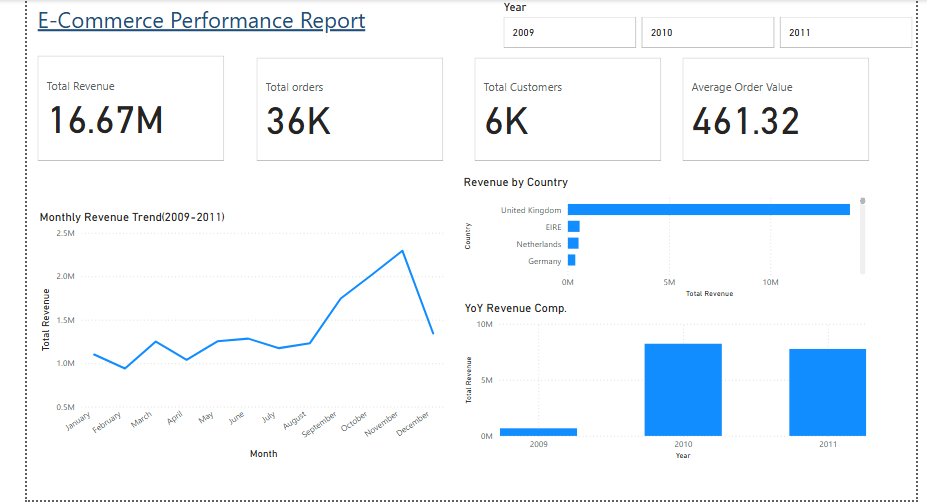
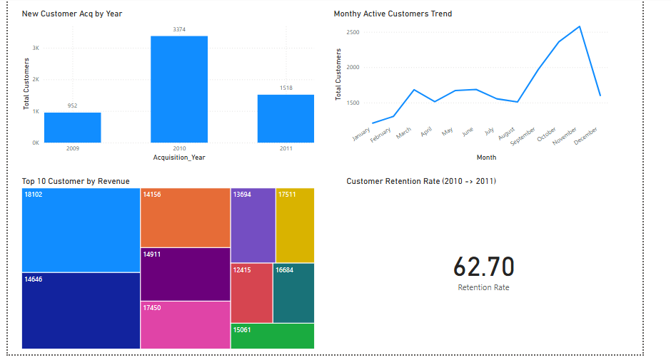
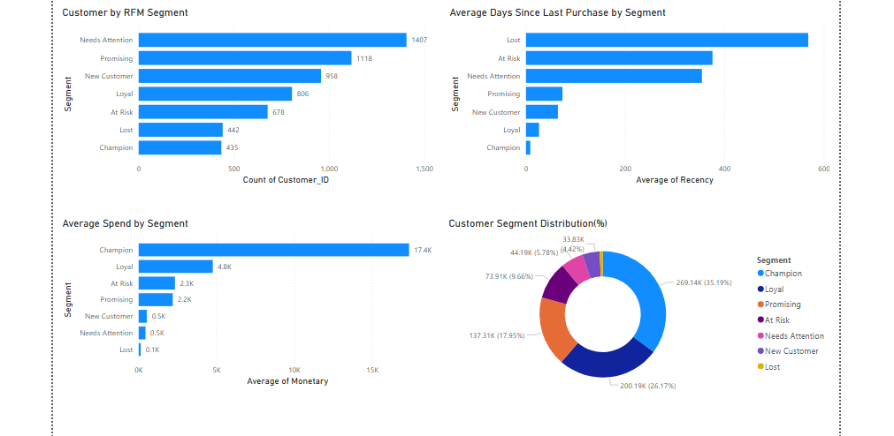
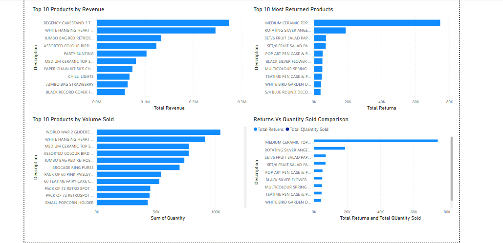

# UK E-Commerce Customer Behaviour Analysis

Customer behaviour analysis and RFM segmentation using UK Online Retail II dataset

## Overview
This project analyses two years of transactional data from a UK-based online gift retailer to understand customer behaviour, identify revenue trends, and segment customers using RFM analysis.

The dataset contained significant quality issues which required careful cleaning before any analysis could begin — making this a realistic end-to-end data project rather than a clean textbook exercise.

---

## Dataset
- **Source:** UCI Machine Learning Repository — Online Retail II Dataset
- **Raw data:** ~1,000,000 rows covering December 2009 to December 2011
- **Data:** Invoice transactions including product details, quantities, prices, customer IDs, and country of purchase

---

## Data Cleaning
The raw dataset required multiple rounds of cleaning before it was suitable for analysis.

**Issues identified and resolved:**
- ~200,000 rows with missing Customer IDs — excluded from customer analysis but retained for overall revenue reporting
- 22,697 return transactions mixed with sales — separated into a dedicated returns table
- 25,941 duplicate rows removed
- 70 zero-price rows removed (data entry errors or free samples)
- Non-product entries such as POSTAGE, MANUAL, and BANK CHARGES removed
- Items priced below £1 investigated and retained — confirmed as legitimate low-value products

**Final clean dataset: 764,884 transactions from 5,844 unique customers**

> During product return analysis, a second round of cleaning was applied — non-product entries recorded with negative quantities were identified and removed from the returns table.

---

## Tools Used
- **Microsoft Excel** — initial data exploration and cleaning
- **SQL Server (MSSQL)** — data storage, transformation, and analysis
- **Power BI** — interactive dashboard and visualisation

---

## Analysis Structure

### 1. Revenue & Sales Analysis
- Year on year revenue comparison (2010 vs 2011)
- Monthly revenue trends and seasonality patterns
- Average order value tracking
- Revenue by country

**Key finding:** Revenue declined 5.6% in 2011 vs 2010. However average order value actually increased from £453 to £470 — meaning customers spent more per visit but ordered less frequently. The decline was driven by order frequency, not customer spending behaviour.

### 2. Customer Analysis
- Unique customer count and acquisition trends
- New vs returning customer breakdown
- Monthly active customer trends
- Customer retention rate calculation

**Key finding:** New customer acquisition dropped 55% in 2011 (3,374 in 2010 vs 1,518 in 2011). However total customer count remained stable at ~4,183 because existing customers stayed loyal. The business was essentially replacing churned customers with new ones — stable on the surface but with an underlying acquisition problem.

**Retention rate: 62.7%** — 2,644 out of 4,216 customers from 2010 returned in 2011.

### 3. RFM Segmentation
Customers were scored on three dimensions using NTILE(5) scoring:
- **Recency** — days since last purchase (lower = better)
- **Frequency** — number of orders placed
- **Monetary** — total spend

| Segment | Customers | Avg Spend | Avg Days Since Purchase |
|---|---|---|---|
| Champion | 435 | £17,376 | 9 days |
| Loyal | 392 | £7,704 | 30 days |
| Promising | 1,532 | £2,147 | 60 days |
| At Risk | 678 | £2,342 | 376 days |
| New Customer | 1,622 | £494 | 166 days |
| Needs Attention | 743 | £472 | 391 days |
| Lost | 442 | £147 | 568 days |

**Key finding:** Champions represent only 7.4% of customers but average £17,376 spend each. Meanwhile 678 At Risk customers haven't purchased in over a year — a targeted win-back campaign could recover significant revenue.

### 4. Product Analysis
- Top 10 products by revenue
- Top 10 products by volume sold
- Most returned products
- Returns vs quantity sold comparison

**Key finding:** Volume leaders and revenue leaders are largely different products. Regency Cakestand 3 Tier leads revenue through premium pricing (£12.46) while World War 2 Gliders leads volume at 104,116 units at only £0.26 per unit.

**Critical finding:** Medium Ceramic Top Storage Jar had 74,494 units returned out of 77,753 sold — a 96% return rate requiring urgent investigation.

---

## Dashboard Pages
1. **Overview** — Revenue KPIs, monthly trend, country breakdown
2. **Customer Analysis** — Acquisition trends, top customers, retention rate
3. **RFM Segments** — Segment distribution, average spend and recency by segment
4. **Product Analysis** — Revenue, volume, returns analysis

---

## Key Business Insights
1. Revenue decline in 2011 was driven by **order frequency drop**, not reduced spending per order
2. **62.7% customer retention** — healthy but 1,572 customers were lost after 2010
3. **435 Champion customers** drive disproportionate revenue at £17,376 average spend
4. **678 At Risk customers** with strong spending history haven't bought in over a year — highest recovery opportunity
5. **Medium Ceramic Storage Jar** has a 96% return rate — urgent product quality investigation needed
6. **White Hanging Heart T-Light Holder** is the only product in both top revenue and top volume lists

---

## Dashboard Preview

### Overview

### Customer Analysis

### RFM Segments

### Product Analysis

## SQL Queries
All SQL queries are available in `UK_Retail_Analysis.sql` with comments explaining the business reasoning behind each query.

---

## Author
**Sanith KP**
Data & MIS Analyst | SQL | Power BI | Excel
[LinkedIn](https://linkedin.com/in/sanithkp)
